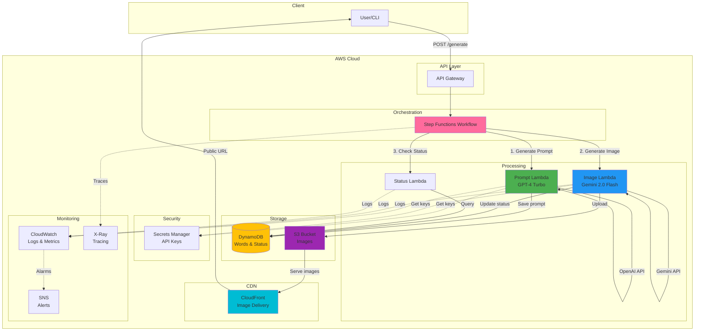
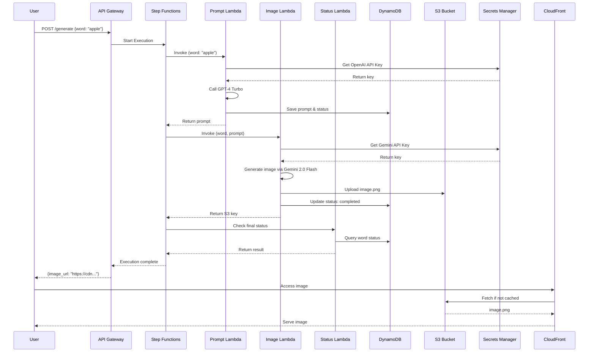

<div align="center">


# 🍉 Kavun - AI-Powered Anki Image Generator

**Serverless image generation pipeline for Anki flashcards using OpenAI GPT-4 and Google Gemini**

[](https://aws.amazon.com/)
[](https://www.python.org/)
[](https://aws.amazon.com/cdk/)
[](LICENSE)

[Features](#-features) • [Architecture](#-architecture) • [Getting Started](#-getting-started) • [Usage](#-usage) • [Development](#-development)

</div>

---

## 📖 Overview

**Kavun** is a fully serverless AWS-based system that automatically generates contextual images for vocabulary learning. Perfect for creating Anki flashcards with AI-generated visuals.

### How it works:
1. **Input**: Submit a word (e.g., "apple")
2. **AI Processing**: GPT-4 generates a descriptive prompt
3. **Image Generation**: Gemini creates a visual representation
4. **Storage**: Image is stored in S3 and served via CloudFront CDN
5. **Output**: Get a public URL for your Anki card

### Key Features ✨

- 🚀 **Fully Serverless** - No servers to manage, scales automatically
- 🤖 **Dual AI Models** - GPT-4 for prompts + Gemini for images
- 📊 **Production Ready** - Monitoring, logging, error handling, retry logic
- 💰 **Cost Effective** - ~$3-5/month for 5000 words
- 🔐 **Secure** - API keys in Secrets Manager, private S3, IAM roles
- ⚡ **Fast** - CloudFront CDN for global image delivery
- 🔄 **Reliable** - Step Functions orchestration with automatic retries
- 📈 **Observable** - CloudWatch dashboards, X-Ray tracing, SNS alerts

---

## 🏗️ Architecture



### Workflow Sequence



---

## 🚀 Getting Started

### Prerequisites

- **AWS Account** with appropriate permissions
- **AWS CLI** configured (`aws configure`)
- **Node.js** 18+ (for CDK)
- **Python** 3.12+
- **OpenAI API Key** ([get here](https://platform.openai.com/api-keys))
- **Google Gemini API Key** ([get here](https://aistudio.google.com/app/apikey))

### Installation

1. **Clone the repository**
```bash
git clone git@github.com:DevoRia/kavun.git
cd kavun
```

2. **Install AWS CDK**
```bash
npm install -g aws-cdk
```

3. **Install Python dependencies**
```bash
# For infrastructure (CDK)
cd iac
pip install -r requirements.txt

# Note: Lambda dependencies are bundled automatically during deployment
```

4. **Bootstrap CDK** (first time only)
```bash
cdk bootstrap
```

### Deployment

1. **Review and customize** (optional)
```bash
cd iac
cdk synth  # Generate CloudFormation template
```

2. **Deploy infrastructure**
```bash
cdk deploy
```

This will create:
- 3 Lambda functions (Prompt, Image, Status)
- 1 Step Functions state machine
- 1 DynamoDB table
- 1 S3 bucket with CloudFront distribution
- CloudWatch dashboards and alarms
- All necessary IAM roles and policies

3. **Configure API Keys**

After deployment, add your API keys to AWS Secrets Manager:

```bash
aws secretsmanager update-secret \
    --secret-id "kavun/api-keys" \
    --secret-string '{
        "openai_key": "sk-proj-...",
        "gemini_key": "AIzaSy..."
    }'
```

> **Note**: The secret name is `kavun/api-keys` and requires both keys in JSON format.

4. **Get your API endpoint**
```bash
aws cloudformation describe-stacks \
    --stack-name KavunStack \
    --query 'Stacks[0].Outputs[?OutputKey==`StateMachineArn`].OutputValue' \
    --output text
```

---

## 🎯 Usage

### Generate Image for a Word

```bash
# Start Step Functions execution
aws stepfunctions start-execution \
    --state-machine-arn "arn:aws:states:REGION:ACCOUNT:stateMachine:kavun-workflow" \
    --input '{"word": "apple", "language": "en"}'
```

### Check Status

```bash
# Invoke Status Lambda directly
aws lambda invoke \
    --function-name kavun-status-checker \
    --payload '{"word": "apple"}' \
    response.json

cat response.json
```

### List All Generated Images

```bash
# Scan DynamoDB for completed images
aws dynamodb scan \
    --table-name kavun-words \
    --filter-expression "#status = :status" \
    --expression-attribute-names '{"#status": "status"}' \
    --expression-attribute-values '{":status": {"S": "completed"}}'
```

### Python SDK Example

```python
import boto3
import json

# Initialize clients
stepfunctions = boto3.client('stepfunctions')
dynamodb = boto3.resource('dynamodb')

# Start image generation
response = stepfunctions.start_execution(
    stateMachineArn='arn:aws:states:REGION:ACCOUNT:stateMachine:kavun-workflow',
    input=json.dumps({
        'word': 'mountain',
        'language': 'en'
    })
)

execution_arn = response['executionArn']
print(f"Started execution: {execution_arn}")

# Check status
table = dynamodb.Table('kavun-words')
result = table.get_item(Key={'word': 'mountain'})

if 'Item' in result:
    print(f"Status: {result['Item']['status']}")
    if result['Item']['status'] == 'completed':
        print(f"Image URL: {result['Item']['image_url']}")
```

---

## ⚙️ Configuration

### AI Models Used

#### 1. **OpenAI GPT-4 Turbo** (Prompt Generation)
- **Model**: `gpt-4-turbo-preview`
- **Purpose**: Generates descriptive, contextual prompts for image generation
- **Input**: Word + Language
- **Output**: Detailed visual description

Example:
```
Input: "apple"
Output: "A crisp, bright red apple with a small green leaf, 
         placed on a rustic wooden table with soft natural lighting"
```

Configuration in `lambdas/prompt/handler.py`:
```python
response = requests.post(
    "https://api.openai.com/v1/chat/completions",
    headers={
        "Authorization": f"Bearer {api_key}",
        "Content-Type": "application/json"
    },
    json={
        "model": "gpt-4-turbo-preview",
        "messages": [
            {
                "role": "system",
                "content": "You are an expert at creating visual descriptions..."
            },
            {
                "role": "user",
                "content": f"Create a visual description for: {word}"
            }
        ],
        "max_tokens": 150,
        "temperature": 0.7
    }
)
```

#### 2. **Google Gemini 2.0 Flash** (Image Generation)
- **Model**: `gemini-2.0-flash-exp`
- **API**: Uses Google AI Studio API (referred to as "Nano Banana" in code)
- **Purpose**: Generates high-quality images from prompts
- **Output Format**: PNG, 1024x1024px, optimized to <400KB

> **Why "Nano Banana"?** It's a playful codename used during development. The actual API is Google's Gemini through AI Studio.

Configuration in `lambdas/image/handler.py`:
```python
response = requests.post(
    f"https://generativelanguage.googleapis.com/v1beta/models/gemini-2.0-flash-exp:generateContent?key={api_key}",
    headers={"Content-Type": "application/json"},
    json={
        "contents": [{
            "parts": [{
                "text": prompt  # From GPT-4
            }]
        }],
        "generationConfig": {
            "response_modalities": ["image"],
            "response_mime_type": "image/png"
        }
    }
)
```

### Lambda Function Configuration

| Function | Runtime | Memory | Timeout | Purpose |
|----------|---------|--------|---------|---------|
| **kavun-prompt-generator** | Python 3.12 | 256 MB | 5 min | GPT-4 API calls |
| **kavun-image-generator** | Python 3.12 | 1024 MB | 5 min | Gemini API + image processing |
| **kavun-status-checker** | Python 3.12 | 128 MB | 30 sec | DynamoDB queries |

### Step Functions Retry Logic

```json
{
  "Retry": [
    {
      "ErrorEquals": ["States.TaskFailed"],
      "IntervalSeconds": 2,
      "MaxAttempts": 3,
      "BackoffRate": 2.0
    }
  ],
  "Catch": [
    {
      "ErrorEquals": ["States.ALL"],
      "ResultPath": "$.error",
      "Next": "HandleFailure"
    }
  ]
}
```

### Environment Variables

All Lambda functions receive:
```bash
TABLE_NAME=kavun-words              # DynamoDB table
BUCKET_NAME=kavun-images-*          # S3 bucket
CLOUDFRONT_URL=https://d*.cloudfront.net
SECRET_ARN=arn:aws:secretsmanager:*
DLQ_TOPIC_ARN=arn:aws:sns:*         # Dead letter queue
```

---

## 📊 Monitoring & Observability

### CloudWatch Dashboard

The stack automatically creates a dashboard with:
- Lambda invocation counts and errors
- Step Functions execution metrics
- DynamoDB read/write capacity
- API Gateway request counts
- S3 bucket size and requests

Access: AWS Console → CloudWatch → Dashboards → `Kavun-Monitoring`

### Alarms

Pre-configured alarms:
- **Lambda Errors**: >5 errors in 5 minutes
- **Step Functions Failures**: >3 failed executions
- **DynamoDB Throttling**: >10 throttled requests
- **Lambda Duration**: >4 minutes (80% of timeout)

All alarms send notifications to SNS topic: `kavun-alerts`

### X-Ray Tracing

Enable detailed request tracing:
```bash
aws xray get-trace-summaries \
    --start-time $(date -u -d '1 hour ago' +%s) \
    --end-time $(date -u +%s) \
    --filter-expression 'service("kavun-workflow")'
```

### Logs

View real-time logs:
```bash
# Prompt Lambda
aws logs tail /aws/lambda/kavun-prompt-generator --follow

# Image Lambda
aws logs tail /aws/lambda/kavun-image-generator --follow

# Status Lambda
aws logs tail /aws/lambda/kavun-status-checker --follow

# Step Functions
aws stepfunctions describe-execution \
    --execution-arn YOUR_EXECUTION_ARN
```

---

## 💰 Cost Breakdown

**Estimated monthly cost for 5,000 words:**

| Service | Usage | Monthly Cost |
|---------|-------|--------------|
| **Lambda** | 15,000 invocations, 512MB avg | ~$2.50 |
| **Step Functions** | 5,000 state transitions | ~$0.25 |
| **DynamoDB** | 10K writes, 50K reads, 1GB storage | ~$1.50 |
| **S3** | 5GB storage, 50K PUT, 500K GET | ~$0.25 |
| **CloudFront** | 100GB data transfer | ~$8.50 |
| **Secrets Manager** | 1 secret | ~$0.40 |
| **CloudWatch** | 10GB logs, custom metrics | ~$2.00 |
| **OpenAI API** | 5K GPT-4 Turbo requests (~750K tokens) | ~$7.50 |
| **Gemini API** | 5K image generations | **FREE** (1500/day limit) |
| **Total AWS** | - | **~$15.40** |
| **Total AI APIs** | - | **~$7.50** |
| **TOTAL** | - | **~$22.90/month** |

> **Note**: Gemini 2.0 Flash has a free tier of 1,500 requests/day. For production at scale, pricing may vary.

### Cost Optimization Tips

1. **Use DynamoDB On-Demand**: Pay per request instead of provisioned capacity
2. **S3 Lifecycle Policies**: Move old images to S3 Glacier after 90 days
3. **CloudFront Caching**: Set long TTL (30+ days) for immutable images
4. **Lambda Reserved Concurrency**: Prevent runaway costs from throttling
5. **Batch Processing**: Generate multiple words in one Step Functions execution

---

## 🛠️ Development

### Project Structure

```
kavun/
├── .assets/                    # Assets for README
│   └── kavun-logo.svg         # Project logo
├── iac/                       # Infrastructure as Code
│   ├── app.py                 # CDK app entry point
│   ├── kavun_stack.py         # Main stack definition
│   ├── cdk.json              # CDK configuration
│   ├── requirements.txt       # Python dependencies for CDK
│   └── tests/                # Infrastructure tests
│       ├── __init__.py
│       ├── test_stack_snapshot.py
│       └── snapshots/
│           └── kavun_stack_snapshot.json
├── lambdas/                   # Lambda function code
│   ├── prompt/               # GPT-4 prompt generation
│   │   ├── handler.py
│   │   ├── requirements.txt
│   │   └── tests/
│   ├── image/                # Gemini image generation
│   │   ├── handler.py
│   │   ├── requirements.txt
│   │   └── tests/
│   └── status/               # Status checking
│       ├── handler.py
│       ├── requirements.txt
│       └── tests/
├── .gitignore
├── README.md
└── requirements.txt           # Root dependencies
```

### Local Development

1. **Install dependencies**
```bash
pip install -r requirements.txt
```

2. **Run tests**
```bash
# Unit tests for Lambda functions
pytest lambdas/prompt/tests/ -v
pytest lambdas/image/tests/ -v
pytest lambdas/status/tests/ -v

# Infrastructure snapshot tests
cd iac
pytest tests/ -v
```

3. **Test Lambda locally**
```bash
cd lambdas/prompt
python -c "
from handler import handler
import json

event = {'word': 'test', 'language': 'en'}
result = handler(event, None)
print(json.dumps(result, indent=2))
"
```

4. **Synthesize CloudFormation**
```bash
cd iac
cdk synth > template.yaml
```

### Testing

```bash
# Run all tests with coverage
pytest --cov=lambdas --cov-report=html

# Test specific Lambda
PYTHONPATH=lambdas/prompt pytest lambdas/prompt/tests/ -v

# Update infrastructure snapshot (after intentional changes)
cd iac
rm tests/snapshots/kavun_stack_snapshot.json
pytest tests/test_stack_snapshot.py
```

### Deployment Workflow

```bash
# 1. Make changes to code
vim lambdas/image/handler.py

# 2. Test locally
pytest lambdas/image/tests/

# 3. Preview changes
cd iac
cdk diff

# 4. Deploy
cdk deploy

# 5. Test in AWS
aws stepfunctions start-execution \
    --state-machine-arn $(aws cloudformation describe-stacks \
        --stack-name KavunStack \
        --query 'Stacks[0].Outputs[?OutputKey==`StateMachineArn`].OutputValue' \
        --output text) \
    --input '{"word": "test"}'
```

### Adding New Features

1. **Add Lambda Environment Variable**
```python
# iac/kavun_stack.py
self.prompt_lambda = lambda_.Function(
    # ...
    environment={
        "NEW_CONFIG": "value"
    }
)
```

2. **Add DynamoDB Attribute**
```python
# lambdas/prompt/handler.py
table.update_item(
    Key={'word': word},
    UpdateExpression='SET new_field = :val',
    ExpressionAttributeValues={':val': 'value'}
)
```

3. **Add Step Functions Task**
```python
# iac/kavun_stack.py
new_task = tasks.LambdaInvoke(
    self, "NewTask",
    lambda_function=self.new_lambda,
    payload=sfn.TaskInput.from_object({"word": sfn.JsonPath.string_at("$.word")})
)

definition = (prompt_task
    .next(image_task)
    .next(new_task)  # Add here
    .next(status_task))
```

---

## 🔒 Security Best Practices

### Implemented Security Measures

✅ **API Keys in Secrets Manager** - Never hardcoded  
✅ **IAM Least Privilege** - Each Lambda has minimal permissions  
✅ **Private S3 Bucket** - Public access blocked, CloudFront only  
✅ **VPC Endpoints** - Private communication between services (optional)  
✅ **Encryption at Rest** - S3 and DynamoDB encrypted  
✅ **CloudTrail Logging** - All API calls audited  
✅ **WAF Rules** - Rate limiting on API Gateway (optional)  

### Recommended Additional Security

```bash
# Enable S3 bucket versioning
aws s3api put-bucket-versioning \
    --bucket kavun-images-ACCOUNT \
    --versioning-configuration Status=Enabled

# Enable DynamoDB point-in-time recovery
aws dynamodb update-continuous-backups \
    --table-name kavun-words \
    --point-in-time-recovery-specification PointInTimeRecoveryEnabled=true

# Rotate API keys regularly
aws secretsmanager rotate-secret \
    --secret-id kavun/api-keys
```

---

## 🐛 Troubleshooting

### Common Issues

#### 1. **Lambda Timeout**
```
Error: Task timed out after 300 seconds
```
**Solution**: Increase timeout in `iac/kavun_stack.py`:
```python
timeout=Duration.minutes(10)
```

#### 2. **Secrets Not Found**
```
Error: SecretNotFoundException: Secrets Manager can't find the specified secret
```
**Solution**: Create/update secret:
```bash
aws secretsmanager create-secret \
    --name kavun/api-keys \
    --secret-string '{"openai_key":"sk-...","gemini_key":"AIza..."}'
```

#### 3. **DynamoDB Throttling**
```
Error: ProvisionedThroughputExceededException
```
**Solution**: Switch to On-Demand mode or increase provisioned capacity

#### 4. **Image Generation Failed**
```
Error: Gemini API returned 400
```
**Solution**: Check prompt length (<2000 chars) and API key validity

#### 5. **S3 Access Denied**
```
Error: AccessDenied: Access Denied
```
**Solution**: Verify Lambda IAM role has `s3:PutObject` permission

### Debug Commands

```bash
# Check Lambda execution logs
aws logs filter-log-events \
    --log-group-name /aws/lambda/kavun-prompt-generator \
    --start-time $(date -d '1 hour ago' +%s)000 \
    --filter-pattern "ERROR"

# Describe Step Functions execution
aws stepfunctions describe-execution \
    --execution-arn YOUR_ARN \
    --query 'status'

# Check DynamoDB item
aws dynamodb get-item \
    --table-name kavun-words \
    --key '{"word": {"S": "test"}}'

# Verify API keys
aws secretsmanager get-secret-value \
    --secret-id kavun/api-keys \
    --query SecretString \
    --output text
```

---

## 📚 API Reference

### DynamoDB Schema

**Table**: `kavun-words`

```json
{
  "word": "apple",                    // Partition key (String)
  "status": "completed",               // Status: pending, generating_prompt, generating_image, completed, failed
  "prompt": "A crisp red apple...",   // Generated prompt
  "image_url": "https://...",         // CloudFront URL
  "s3_key": "images/apple.png",       // S3 object key
  "created_at": "2024-01-15T10:30:00Z",
  "updated_at": "2024-01-15T10:31:00Z",
  "language": "en",                    // Language code
  "error_message": null                // Error if failed
}
```

**GSI**: `StatusIndex` - Query by status

### Step Functions Input/Output

**Input**:
```json
{
  "word": "mountain",
  "language": "en"
}
```

**Output**:
```json
{
  "word": "mountain",
  "status": "completed",
  "prompt": "A majestic mountain peak...",
  "image_url": "https://d1234.cloudfront.net/images/mountain.png",
  "s3_key": "images/mountain.png",
  "timestamp": "2024-01-15T10:35:00Z"
}
```

---

## 🤝 Contributing

Contributions are welcome! Please follow these guidelines:

1. Fork the repository
2. Create a feature branch (`git checkout -b feature/amazing-feature`)
3. Commit your changes (`git commit -m 'Add amazing feature'`)
4. Push to the branch (`git push origin feature/amazing-feature`)
5. Open a Pull Request

### Development Guidelines

- Write tests for new features
- Follow PEP 8 style guide
- Update documentation
- Add type hints
- Run linters: `black`, `flake8`, `mypy`

---

## 📄 License

This project is licensed under the MIT License - see the [LICENSE](LICENSE) file for details.

---

## 🙏 Acknowledgments

- **OpenAI** for GPT-4 Turbo API
- **Google** for Gemini 2.0 Flash API
- **AWS** for serverless infrastructure
- **CDK** for infrastructure as code

---

## 📧 Support

- **Issues**: [GitHub Issues](https://github.com/DevoRia/kavun/issues)
- **Discussions**: [GitHub Discussions](https://github.com/DevoRia/kavun/discussions)

---

<div align="center">

**Made with ❤️ and 🍉**

*Generate beautiful images for your Anki flashcards, automatically!*

</div>
